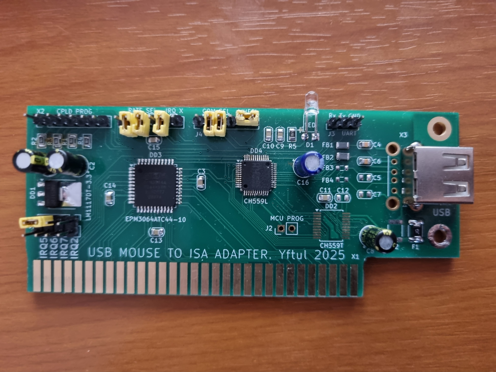

# usb-mouse-2-isa




**Проект / Project**
Подключение современной USB-мыши к старым ПК, которые ожидают COM мышь.
Connect a modern USB mouse to an old PC expecting a COM mouse.

---

## Описание / Description

Проект `usb-mouse-2-isa` предназначен для реализации поддержки USB-мышей на ретро-компьютерах c ISA шиной.
The `usb-mouse-2-isa` project aims to support USB mice on vintage computers with ISA bus.

В основе — микроконтроллер и программируемая логика, которая:
On the core — a microcontroller and programmable logic that:

- принимает сигналы от USB-мыши / reads data from USB mouse;
- преобразует этот ввод в эмуляцию COM портовой мыши на ISA шине / converts them into amulation of serial mouse on ISA bus.
- обеспечивает базовую функциональность: движение, нажатия кнопок, скроллинг / provides basic functionality: moving, buttons pressing, wheel scrolling.

---

## Структура репозитория / Repository structure

- `MCU/` — исходники микроконтроллера (C/ASM). / microcontroller firmware (C/ASM).
- `CPLD/` — исходники CPLD (VHDL). / CPLD logic design (VHDL).
- `SCHEME/` — схемы подключения, разводка. / schematics, wiring.
- `BIN/` — собранные прошивки. / compiled firmware.
- `README.md` — этот файл. / this README.
- `LICENSE` — лицензия проекта (например, GPL-3.0). / license file (e.g. GPL-3.0).

---

## Требования железа / Hardware requirements

- USB HID-мышь. / USB HID mouse.
- ПК с ISA-шиной и свободными ресурсами для подключения эмулируемого COM порта. / PC with ISA bus and enouth free resources to plug emulated COM port.
- Стандартный драйвер COM мыши / Standard serial mouse driver.

---

## Требования ПО / Software requirements

```bash
# 1. Сборка прошивки микроконтроллера / MCU firmware build
MCU: make clean && make

# 2. Для прошивки используется утилита WCHISPTool и кабель "USB-A - USB-A" / To flash MCU use WCHISPTool and cable "USB-A - USB-A"

# 3. Cинтез и прошивка CPLD / FPGA sinthesis and flash
Quartus 13 or less + Altera byte blaster
