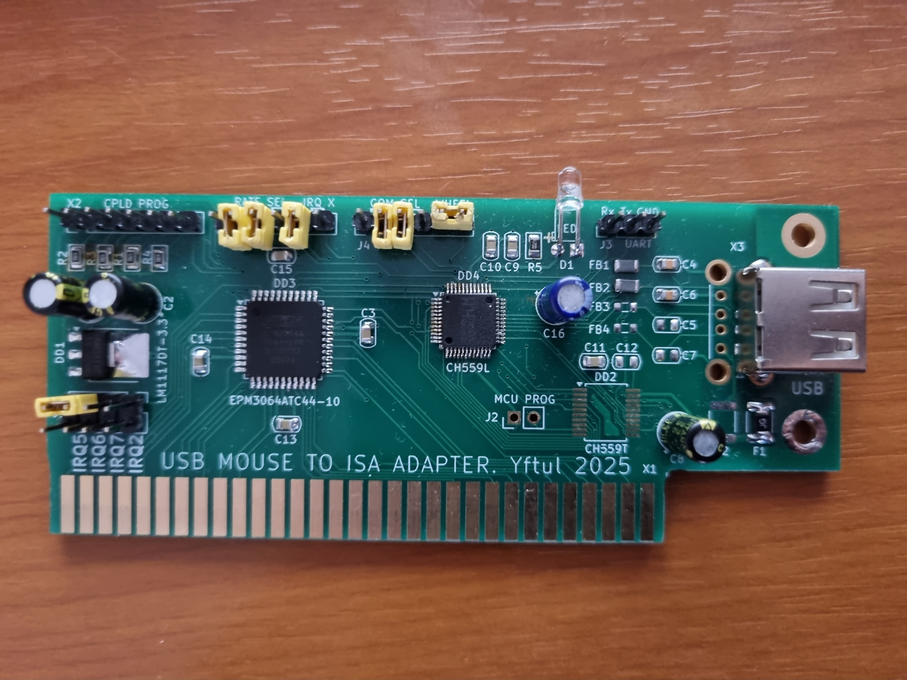

# usb-mouse-2-isa




**Проект / Project**
Подключение современной USB-мыши к старым ПК, ожидающим COM мышь.
Connect a modern USB mouse to an old PC expecting a COM mouse.

---

## Описание / Description

Проект `usb-mouse-2-isa` предназначен для реализации поддержки USB-мышей на ретро-компьютерах c ISA шиной.
The `usb-mouse-2-isa` project aims to provide USB mouse support on vintage computers with an ISA bus.

В основе — микроконтроллер и программируемая логика, которая:
At the core are a microcontroller and programmable logic that:

- принимает сигналы от USB-мыши / receive data from a USB mouse;
- преобразует в эмуляцию COM портовой мыши на ISA шине / converts into an emulation of a serial mouse on ISA bus.
- обеспечивает базовую функциональность: движение, нажатие кнопок, прокрутку / provide basic functionality: movement, button clicks, and wheel scrolling.

---

## Общие сведения / General info
Устройство устанавливается в ISA слот. Мышь подключается в USB разъём. При сбросе компьютера, включении и отключении мыши мигает светодиод активности VD1. Также он мигает, если работает драйвер выши и мышь проявляет какую-либо активность.
Перемычками COM SEL J4 можно выбрать COM порт COM1-COM4. При необходимости выбрать нестандартное прерывание, нужно установить перемычку IRQX J5 и выбрать необходимое прерывание IRQ2,5,6,7 установкой перемычки J1. Например:
оставив J4 1-2 3-4 и J5 5-6 без перемычек(open), устройство будет настроена на работу в качестве порта COM1 со стандартными port и IRQ 0x3F8/IRQ3. Если же установить все три перемычки, устройство будет откликаться на стандартный адрес COM4 0x2E8, но из-за установленного IRQX использовать один их IRQ2,5,6,7, выбранный перемычкой J1.
Все комбинации перемычек подписаны на плате.

Кроме того, можно выбрать поддержку колесика мыши, установив перемычку wheel J4 5-6. И уменьшить частоту передачи данных мыши по порту, установив перемычки Rate, где открытым(open) перемычкам соответсвует скорость передачи по умолчанию, устанавливая перемычки, замедляем скорость передачи до 4х раз.
/
The device is installed into an ISA slot. The mouse is connected to the USB port. When the computer is reset, powered on, or when the mouse is plugged  or unplugged, the activity LED VD1 blinks. It also blinks when the mouse driver is running and the mouse generates any activity.

The COM SEL J4 jumpers allow selecting the COM port number (COM1–COM4). If a non‑standard interrupt is required, you must enable the IRQX jumper J5 and select the desired interrupt (IRQ2, 5, 6, or 7) using jumper J1. Examples:

 - if J4 1–2 and 3–4 are closed, and J5 5–6 is open, the device will be configured as COM1 with the standard port and IRQ (0x3F8 / IRQ3).
 - if all three jumpers are closed, the device will be at the standard COM4 address 0x2E8, but because IRQX is enabled, it will use one of IRQ2, 5, 6, or 7 selected by the jumper J1.

All possible jumpers combinations are written on the PCB.

Additionally, mouse wheel support can be enabled by closing the “wheel” jumper J4 5–6.  
You can also reduce the mouse data rate by configuring the Rate jumpers: the open (default) position corresponds to the normal data rate, and installing the jumpers reduces the rate by up to 4×.

## Структура репозитория / Repository structure

- `MCU/` — исходники микроконтроллера (C/ASM). / microcontroller firmware (C/ASM).
- `CPLD/` — исходники CPLD (VHDL). / CPLD logic design (VHDL).
- `SCHEME/` — схемы подключения, разводка. / schematics, wiring.
- `BIN/` — собранные прошивки. / compiled firmware.
- `README.md` — этот файл. / this README.
- `LICENSE` — лицензия проекта (GPL-3.0). / license file (GPL-3.0).

---

## Требования железа / Hardware requirements

- USB HID-мышь. / USB HID mouse.
- ПК с ISA-шиной и свободными ресурсами для подключения эмулируемого COM порта. / PC with ISA bus and enouth free resources to attach emulated COM port.
- Стандартный драйвер COM мыши / Standard serial mouse driver.

---

## Требования ПО / Software requirements

```bash
# 1. Сборка прошивки микроконтроллера / MCU firmware build
MCU: make clean && make

# 2. Для прошивки используется утилита WCHISPTool и кабель "USB-A - USB-A" / To flash MCU use WCHISPTool and cable "USB-A - USB-A"

# 3. Cинтез и прошивка CPLD / FPGA sinthesis and flash
Quartus 13 or earlier  + Altera byte blaster
